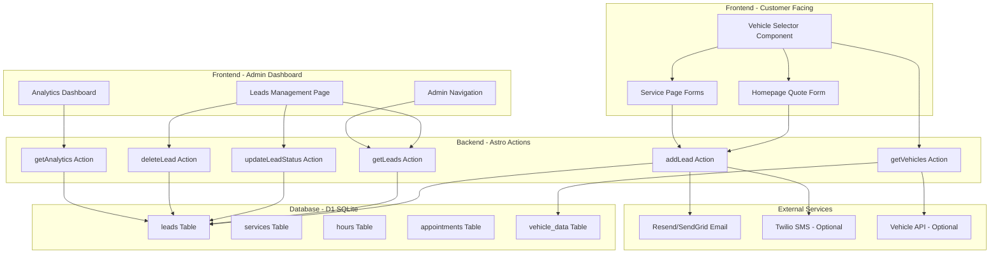

# Lead Generation & Management System - PRD

## Overview
Build a comprehensive lead capture and management system for Sal's Wheels & Tires, enabling customers to request quotes and appointments through the website while providing the business owner with tools to track, manage, and convert leads through an admin dashboard.

## Problem Statement
Sal's Wheels & Tires currently has a marketing website and basic admin dashboard with a leads table in the database, but no way to capture leads from customers or manage them. The business needs a systematic way to:
1. Capture customer inquiries from the website
2. Track lead sources and conversion progress
3. Manage follow-ups efficiently
4. Schedule appointments based on business hours
5. Receive notifications for new leads

## Goals
- **Primary Goal 1**: Enable customers to submit quote requests and appointment bookings through the website with a mobile-friendly, accessible form
- **Primary Goal 2**: Provide business owners with a full-featured admin dashboard to view, filter, update, and manage leads
- **Secondary Goal 3**: Implement lead source tracking, email/SMS notifications, and appointment scheduling functionality
- **Secondary Goal 4**: Add lead analytics dashboard with conversion metrics and source breakdown

## Non-Goals
- Integration with external CRM systems (e.g., Salesforce, HubSpot) in this iteration
- Multi-tenant support (single business instance only)
- Advanced AI lead scoring or automated follow-up sequences
- Customer portal for viewing appointment history
- Payment processing for appointments

## Requirements

### Functional Requirements

#### Priority 1 - Core Lead Capture

- **FR-1**: Homepage contact form must capture customer name, phone, email, vehicle information, service type, and message/notes
- **FR-2**: Vehicle information field should support both free-text entry and structured year/make/model format
- **FR-3**: Service type dropdown must be dynamically populated from the `services` table
- **FR-4**: Form submission must create a lead record with status="new" and store timestamp in `createdAt` field
- **FR-5**: Form must validate required fields (name at minimum, phone OR email recommended) before submission
- **FR-6**: Admin leads management page at `/admin/leads` must display all leads in a table/list format
- **FR-7**: Admin interface must support filtering leads by status (new, contacted, converted, closed) and date range
- **FR-8**: Admin must be able to view complete lead details including all captured fields
- **FR-9**: Admin must be able to update lead status through the workflow (new → contacted → converted → closed)
- **FR-10**: Admin must be able to delete leads with confirmation dialog
- **FR-11**: Admin navigation sidebar must include leads count badge showing number of new leads
- **FR-12**: Admin dashboard overview must display new leads count in existing stats card

#### Priority 2 - Enhanced Lead Capture

- **FR-13**: Vehicle selector component must provide cascading dropdowns for year, make, and model selection
- **FR-14**: Vehicle selector must support free-text fallback for vehicles not in database
- **FR-15**: Vehicle selector must be reusable across multiple forms (homepage, service pages)
- **FR-16**: Vehicle database must be sourced from either static JSON file (~5000 popular vehicles) or free API (e.g., CarMD, NHTSA)
- **FR-17**: Individual service pages at `/services/[slug]` must display targeted quote forms pre-filled with the service type
- **FR-18**: Lead source tracking must capture where the lead came from (homepage, service page, Google, Facebook, direct, other)
- **FR-19**: Leads table must be updated to include `source` field and optionally `sourceUrl` for UTM tracking
- **FR-20**: Form submissions must automatically detect and capture UTM parameters (utm_source, utm_medium, utm_campaign) from URL

#### Priority 3 - Notifications & Scheduling

- **FR-21**: System must send email notification to business owner when a new lead arrives
- **FR-22**: Email notification must include lead details (customer info, vehicle, service type, message, source)
- **FR-23**: Optional: System must support SMS notifications via Twilio for new leads
- **FR-24**: Quote request form must include optional appointment scheduling with date/time picker
- **FR-25**: Appointment time slots must be restricted to business hours defined in the `hours` table
- **FR-26**: System must prevent double-booking by checking existing appointments
- **FR-27**: System must send confirmation email to customer with appointment details
- **FR-28**: Confirmation email must include business address, phone, and link to reschedule
- **FR-29**: Appointments table must be created with fields: id, leadId, date, time, status (scheduled, completed, cancelled, no-show), notes
- **FR-30**: Admin dashboard must include lead analytics page at `/admin/analytics`
- **FR-31**: Analytics dashboard must display line chart showing leads over time (daily/weekly/monthly)
- **FR-32**: Analytics dashboard must show conversion rate metrics (new → contacted, contacted → converted, overall)
- **FR-33**: Analytics dashboard must display lead source breakdown with pie chart or bar visualization
- **FR-34**: Analytics dashboard must show average time to first response based on status transitions

### Non-Functional Requirements

- **NFR-1 Performance**: Form submission must complete within 2 seconds on Cloudflare Workers edge runtime
- **NFR-2 Security**: All form inputs must be sanitized and validated to prevent XSS and SQL injection attacks
- **NFR-3 Scalability**: System must support 10,000+ leads without performance degradation in D1 database
- **NFR-4 Accessibility**: Forms must meet WCAG 2.1 AA standards (keyboard navigation, screen reader support, proper labels)
- **NFR-5 Mobile Responsiveness**: All forms and admin pages must be fully functional on mobile devices (320px+ width)
- **NFR-6 Reliability**: Email notifications must be delivered with 99% uptime using retry logic
- **NFR-7 Edge Compatibility**: All features must work within Cloudflare Workers CPU time limits (50ms for free, 10s for paid)
- **NFR-8 Database Consistency**: All database operations must use Drizzle ORM transactions where appropriate
- **NFR-9 Data Privacy**: Phone numbers and emails must be stored securely; contact details visible only to authenticated admin users

## Proposed Architecture

### System Design



### Component Breakdown

#### Frontend Components

- **QuoteForm**: Main form component for capturing lead information (name, phone, email, vehicle, service, message, optional appointment)
- **VehicleSelector**: Reusable cascading dropdown component with year/make/model selection and free-text fallback
- **AppointmentScheduler**: Date/time picker component respecting business hours and preventing double-booking
- **LeadsManager**: Admin component displaying lead list with filtering, sorting, and status update controls
- **LeadDetailsModal**: Modal component for viewing full lead details and adding notes
- **LeadsAnalytics**: Dashboard component displaying charts and metrics (line chart for leads over time, pie chart for source breakdown, conversion funnel)
- **AdminNav**: Enhanced navigation sidebar with leads count badge

#### Backend Actions

- **addLead**: Inserts new lead record, captures UTM parameters, triggers notifications, creates appointment if scheduled
- **getLeads**: Retrieves leads with optional filtering by status, date range, source
- **updateLeadStatus**: Updates lead status and timestamp, logs status change history
- **deleteLead**: Soft or hard delete of lead record
- **getVehicles**: Returns vehicle years/makes/models from database or API
- **getAnalytics**: Aggregates lead data for analytics dashboard (counts, conversion rates, source breakdown)
- **getAvailableSlots**: Returns available appointment slots based on business hours and existing appointments
- **scheduleAppointment**: Creates appointment record and sends confirmation email

#### Database Schema Updates

```sql
-- Update existing leads table
ALTER TABLE leads ADD COLUMN source TEXT DEFAULT 'direct';
ALTER TABLE leads ADD COLUMN sourceUrl TEXT DEFAULT '';
ALTER TABLE leads ADD COLUMN utmSource TEXT DEFAULT '';
ALTER TABLE leads ADD COLUMN utmMedium TEXT DEFAULT '';
ALTER TABLE leads ADD COLUMN utmCampaign TEXT DEFAULT '';
ALTER TABLE leads ADD COLUMN notes TEXT DEFAULT '';
CREATE INDEX idx_leads_status ON leads(status);
CREATE INDEX idx_leads_createdAt ON leads(createdAt);
CREATE INDEX idx_leads_source ON leads(source);

-- New appointments table
CREATE TABLE appointments (
  id INTEGER PRIMARY KEY AUTOINCREMENT,
  leadId INTEGER NOT NULL REFERENCES leads(id) ON DELETE CASCADE,
  date TEXT NOT NULL,
  time TEXT NOT NULL,
  status TEXT DEFAULT 'scheduled', -- scheduled, completed, cancelled, no-show
  notes TEXT DEFAULT '',
  createdAt TEXT DEFAULT '',
  updatedAt TEXT DEFAULT ''
);
CREATE INDEX idx_appointments_date ON appointments(date);
CREATE INDEX idx_appointments_leadId ON appointments(leadId);

-- New lead_status_history table for tracking changes
CREATE TABLE lead_status_history (
  id INTEGER PRIMARY KEY AUTOINCREMENT,
  leadId INTEGER NOT NULL REFERENCES leads(id) ON DELETE CASCADE,
  fromStatus TEXT,
  toStatus TEXT NOT NULL,
  changedAt TEXT DEFAULT '',
  changedBy TEXT DEFAULT 'system',
  notes TEXT DEFAULT ''
);
CREATE INDEX idx_statusHistory_leadId ON lead_status_history(leadId);

-- Optional: vehicle_data table for static vehicle database
CREATE TABLE vehicle_data (
  id INTEGER PRIMARY KEY AUTOINCREMENT,
  year INTEGER NOT NULL,
  make TEXT NOT NULL,
  model TEXT NOT NULL,
  trim TEXT DEFAULT '',
  UNIQUE(year, make, model, trim)
);
CREATE INDEX idx_vehicle_data_year ON vehicle_data(year);
CREATE INDEX idx_vehicle_data_make ON vehicle_data(make);
```

### Data Flow

1. **Lead Capture Flow**:
   - Customer fills out quote form (homepage or service page)
   - VehicleSelector cascading dropdowns provide structured vehicle selection
   - Form validation ensures required fields are complete
   - Form submission calls `addLead` action
   - Action captures UTM parameters from URL
   - Lead record inserted into `leads` table with status="new"
   - If appointment scheduled, record created in `appointments` table
   - Email notification sent to business owner via Resend/SendGrid
   - SMS notification sent via Twilio (optional)
   - If appointment, confirmation email sent to customer
   - Success feedback displayed to customer

2. **Lead Management Flow**:
   - Admin navigates to `/admin/leads`
   - `getLeads` action retrieves lead list with optional filters
   - Lead table displays with sorting by date desc
   - Admin clicks lead to view details in modal
   - Admin updates status via dropdown (new → contacted → converted → closed)
   - `updateLeadStatus` action updates record and logs to `lead_status_history`
   - Admin can add notes to lead record
   - Admin can delete lead with confirmation
   - Lead count badges update in real-time

3. **Analytics Flow**:
   - Admin navigates to `/admin/analytics`
   - `getAnalytics` action queries lead data for aggregations
   - Charts render with:
     - Line chart: leads count grouped by date (last 30/60/90 days)
     - Conversion funnel: new → contacted → converted counts
     - Source breakdown: pie chart of lead sources
     - Average response time: time between createdAt and first status change

## Technical Considerations

### Technology Choices

- **Astro Actions**: Server-side form handlers already implemented and well-tested in the codebase; provides type-safe client/server communication
- **Drizzle ORM**: Already in use; type-safe SQL queries, excellent D1 support, schema versioning with migrations
- **React Components**: Already in use for admin components; component reusability and state management for complex forms
- **Cloudflare D1**: SQLite at the edge; zero cold starts for reads, excellent for this scale (10K+ leads easily supported)
- **Resend**: Email API optimized for Cloudflare Workers; reliable, good documentation, free tier sufficient for testing
- **Recharts**: Charting library for React; lightweight, works well with edge runtime, supports required chart types
- **Lucide React**: Icon library already used in codebase; consistent icon style
- **zod**: Already in use for schema validation; robust input validation and type inference

### Trade-offs Analyzed

| Option | Pros | Cons | Recommendation |
|--------|------|------|----------------|
| **Static JSON vs API for Vehicle Data** | Static: No external dependencies, faster, offline capable<br>API: More comprehensive, always up-to-date | Static: Requires manual updates, limited to ~5000 vehicles<br>API: Rate limits, latency, potential downtime | ✅ Static JSON with top 5000 vehicles for MVP; API integration as enhancement |
| **Resend vs SendGrid for Email** | Resend: Cloudflare-native, lower latency, simpler API<br>SendGrid: More features, industry standard | Resend: Newer, fewer integrations<br>SendGrid: Higher latency from Workers | ✅ Resend (optimized for Workers, lower complexity) |
| **Twilio SMS vs Email Only** | SMS: Higher open rate, immediate<br>Email Only: Simpler, no cost | SMS: Additional cost, requires phone validation | ❌ Email only for MVP, Twilio as optional enhancement |
| **Soft Delete vs Hard Delete** | Soft: Data recovery, audit trail<br>Hard: Simpler, cleaner database | Soft: More complex queries<br>Hard: Permanent data loss | ✅ Soft delete for audit compliance (add deletedAt column) |
| **Client-side vs Server-side Chart Rendering** | Client-side: Less CPU on Workers, better interactivity<br>Server-side: Faster initial load, works without JS | Client-side: More data transfer<br>Server-side: Limited Workers CPU | ✅ Client-side with Recharts (standard pattern, good UX) |
| **UTM Parameter Storage** | Store: Rich analytics, campaign tracking<br>Don't Store: Simpler schema | Store: Larger records, more fields | ✅ Store (critical for lead source tracking) |
| **Calendar UI Component** | Custom: Full control, matches brand<br>Library: Faster development, battle-tested | Custom: More development time<br>Library: May not match theme perfectly | ✅ Custom simple date/time picker (Tailwind + Lucide, minimal complexity) |
| **Real-time Updates** | WebSocket: Instant updates<br>Polling: Simpler implementation | WebSocket: Higher complexity, Workers limitations<br>Polling: Delayed updates | ❌ No real-time needed for MVP; page refresh sufficient |
| **Appointment Conflict Prevention** | Database constraints: Absolute safety<br>Application logic: More flexibility | DB constraints: Complex queries<br>App logic: Race conditions possible | ✅ Database unique constraint on (date, time, status=scheduled) |

## Implementation Strategy

### Phased Approach

#### Phase 1: Core Lead Capture (Priority 1)
**Duration: 1-2 weeks**

**Milestones:**
1. Database schema updates (source fields, indexes)
2. QuoteForm component with basic vehicle input (free-text)
3. Homepage contact form integration
4. AddLead action with UTM parameter capture
5. Basic success/error handling
6. Leads management page at `/admin/leads`
7. Lead list table with status filtering
8. Lead details modal
9. Update lead status functionality
10. Delete lead functionality
11. Admin navigation with leads count badge

**Deliverables:**
- Working quote form on homepage
- Admin leads page with full CRUD operations
- All Priority 1 functional requirements met

#### Phase 2: Enhanced Lead Capture (Priority 2)
**Duration: 1-2 weeks**

**Milestones:**
1. Vehicle selector component development
2. Vehicle data integration (static JSON with 5000 vehicles)
3. Replace free-text vehicle input with VehicleSelector
4. Update leads table schema (add notes column)
5. Service page forms with pre-filled service type
6. UTM parameter capture in form submission
7. Lead source tracking logic
8. GetVehicles action implementation
9. Vehicle selector reusability verification
10. Form accessibility testing and remediation

**Deliverables:**
- Vehicle selector component working across all forms
- Service-specific quote forms
- Full UTM tracking and source attribution

#### Phase 3: Notifications & Scheduling (Priority 3)
**Duration: 2-3 weeks**

**Milestones:**
1. Email service integration (Resend)
2. Email template design and testing
3. New lead notification to business owner
4. Appointment table schema creation
5. AppointmentScheduler component (date/time picker)
6. GetAvailableSlots action (business hours logic)
7. ScheduleAppointment action
8. Appointment conflict prevention logic
9. Customer confirmation email
10. Analytics dashboard page at `/admin/analytics`
11. Leads over time chart implementation
12. Conversion rate metrics calculation
13. Source breakdown chart implementation
14. Analytics action aggregation queries

**Deliverables:**
- Full notification system (email, optional SMS)
- Appointment scheduling with conflict prevention
- Analytics dashboard with all visualizations

#### Phase 4: Polish & Optimization (Optional Enhancement)
**Duration: 1 week**

**Milestones:**
1. Lead status history tracking
2. Soft delete implementation
3. Advanced filtering (date range, text search)
4. Bulk actions (bulk status update, bulk delete)
5. Mobile optimization refinements
6. Performance optimization (lazy loading, pagination)
7. Error handling improvements
8. Analytics date range selector
9. Export leads to CSV functionality

**Deliverables:**
- Production-ready lead management system
- Advanced admin features

### Risk Mitigation

| Risk | Impact | Mitigation |
|------|--------|------------|
| **Vehicle API rate limits or downtime** | High | Use static JSON fallback; implement caching; design graceful degradation to free-text input |
| **Email delivery failures** | High | Implement retry logic (3 attempts with exponential backoff); log failed sends; fallback to database-only capture; use Resend's webhook for delivery status |
| **Cloudflare Workers CPU timeout** | Medium | Optimize database queries with indexes; use batching for multiple operations; move expensive operations (analytics aggregation) to scheduled background jobs |
| **Appointment double-booking** | High | Database unique constraint on (date, time, status=scheduled); use transactions; implement slot locking mechanism |
| **Mobile responsiveness issues** | Medium | Test on actual devices (iOS, Android) during development; use responsive design principles; implement touch-friendly UI elements |
| **Data loss from hard deletes** | Medium | Implement soft delete pattern with deletedAt column; add confirmation dialogs; implement admin audit logs |
| **UTM parameter loss** | Low | Store UTM in session/localStorage for multi-step forms; capture immediately on page load; test with various referrer sources |
| **Analytics performance degradation** | Medium | Implement materialized views or pre-aggregated tables for analytics; cache query results; limit date ranges |
| **Spam/fake lead submissions** | Medium | Implement rate limiting by IP; add reCAPTCHA or Cloudflare Turnstile; add honeypot field; require phone OR email validation |
| **Accessibility compliance gaps** | Low | Use semantic HTML; implement ARIA labels; test with screen readers; use form validation library with a11y support |

## Success Metrics

- **Metric 1**: Lead capture conversion rate (form visits / form submissions) - Target: 15-25%
- **Metric 2**: Average time from lead submission to first status update - Target: < 4 hours
- **Metric 3**: Lead conversion rate (new leads / converted leads) - Target: 20-30%
- **Metric 4**: Email notification delivery success rate - Target: > 99%
- **Metric 5**: Form submission completion time - Target: < 2 seconds
- **Metric 6**: Appointment no-show rate - Target: < 15%
- **Metric 7**: Mobile form completion rate - Target: > 90% of desktop rate
- **Metric 8**: Admin dashboard page load time - Target: < 1 second
- **Metric 9**: Analytics query response time - Target: < 500ms
- **Metric 10**: User satisfaction (survey after 1 month) - Target: 4.5/5 stars

## Open Questions

- **Question 1**: Vehicle data sourcing - Should we use a free public API (NHTSA has a VIN decoder API but limited make/model data) or maintain a static JSON file? API is more comprehensive but introduces external dependency. Static JSON with 5000 popular vehicles covers 80%+ of use cases.
  - **Possible Answers**: 
    - Static JSON for MVP, add API integration later (Recommended)
    - Hybrid approach: Static JSON with API fallback for lookups
    - Full API integration from start

- **Question 2**: Appointment scheduling complexity - Should we support recurring appointments, multi-day appointments, or single appointments only? Multi-day requires significant UI complexity.
  - **Possible Answers**: 
    - Single appointments only (Recommended for MVP)
    - Single + multi-day support (more complex)
    - Single + recurring (most complex)

- **Question 3**: SMS notifications priority - Twilio adds cost ($0.0075/message) but provides immediate notification. Is this critical for business operations or can email suffice?
  - **Possible Answers**: 
    - Email only for MVP (lower cost, sufficient)
    - Email + SMS for high-priority leads (new leads only)
    - Email + SMS for all lead events (highest cost, best UX)

- **Question 4**: Analytics data retention - How long should we keep raw lead data vs aggregated analytics? Raw data retention affects D1 storage and query performance.
  - **Possible Answers**: 
    - Keep all raw data indefinitely (simpler, performance concerns)
    - Archive old leads (> 1 year) to separate table
    - Delete leads older than X months after conversion (GDPR compliance)

- **Question 5**: Authentication for admin - Current admin dashboard has no authentication. Should we add Cloudflare Access, basic auth, or implement a full authentication system?
  - **Possible Answers**: 
    - Add Cloudflare Access (recommended for production, minimal code changes)
    - Implement simple password-protected route with Astro middleware
    - Build full authentication system with session management (overkill for single tenant)

- **Question 6**: Lead source attribution - How granular should UTM tracking be? Should we track all UTM parameters or just source/medium/campaign?
  - **Possible Answers**: 
    - Full UTM tracking (source, medium, campaign, content, term)
    - Simplified tracking (source, medium, campaign only - Recommended)
    - Basic tracking (source only)

- **Question 7**: Analytics dashboard scope - Should analytics be real-time or updated periodically? Real-time is better UX but requires more complex infrastructure.
  - **Possible Answers**: 
    - Real-time on every page load (simple but resource-intensive)
    - Cached with 5-15 minute TTL (Recommended - good balance)
    - Pre-aggregated via scheduled job (most efficient but complex)

- **Question 8**: Form validation approach - Should we use client-side validation only, server-side only, or both for robustness?
  - **Possible Answers**: 
    - Client-side only (faster UX but less secure)
    - Server-side only (secure but poor UX)
    - Both - client-side for UX + server-side for security (Recommended)

- **Question 9**: Appointment duration - Should appointments be fixed duration (e.g., 30 minutes) or variable based on service type from the services table?
  - **Possible Answers**: 
    - Fixed 30-minute slots (simpler, less UI)
    - Variable based on service.duration field (more accurate, more complex)
    - Configurable per service with admin overrides (most flexible)

- **Question 10**: Lead export functionality - Should we support exporting leads to CSV/Excel for external reporting or CRM integration?
  - **Possible Answers**: 
    - No export (MVP - keep data in system)
    - Basic CSV export (Recommended - simple to implement)
    - Excel export with formatting (more complex)
    - Full API for external integrations (out of scope for now)
